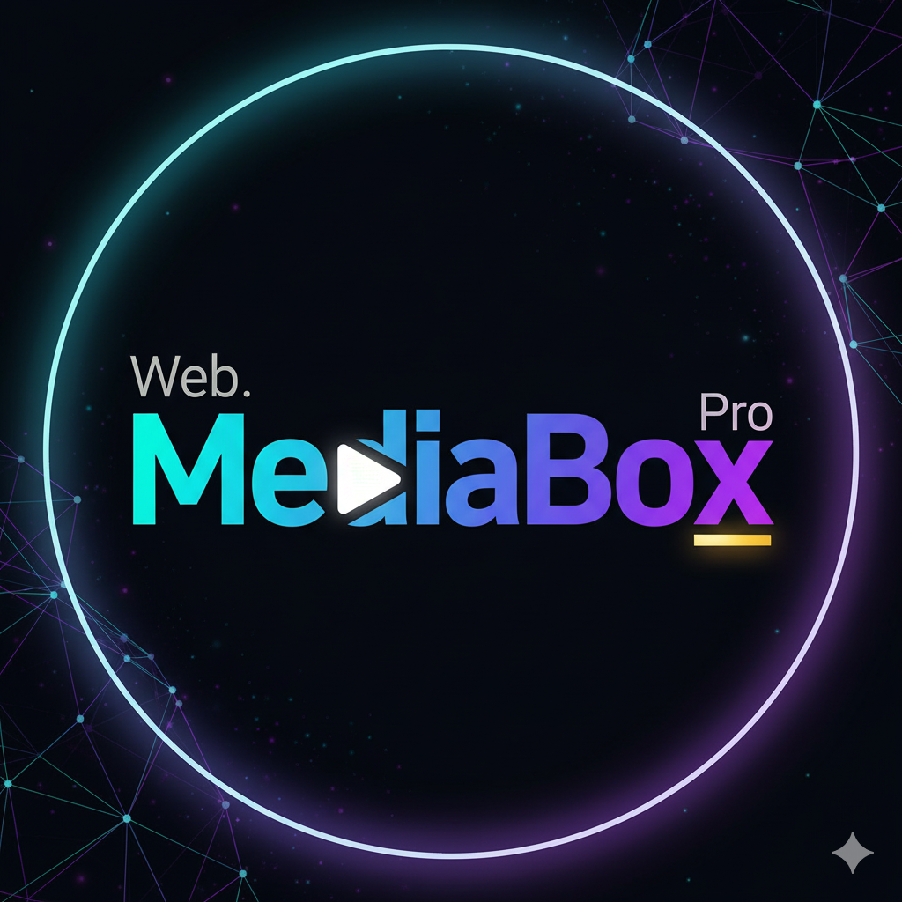

  
   

# 🎬 Web.MediaBox.Pro 🚀

**A powerful, private, browser-based media player with game-changing independent volume control.**

Welcome to **Web.MediaBox.Pro**, a lightweight yet powerful media player designed for the ultimate viewing experience right in your browser. This single-file web application lets you play local video files or stream from the web with a rich set of features that rival native applications—all without any installation.

The core mission of this app is to solve a common frustration: the inability to control a video's volume independently of your device's main audio. With Web.MediaBox.Pro, you can finally mute your movie while still listening to music or a podcast from another app. It’s a level of control that standard players simply don't offer.

---
## ✨ Features & Functions

Dive into a feature set designed to make you fall in love with watching videos all over again.

* 🔊 **Independent Volume Control**: The feature that started it all! Mute, raise, or lower the player's volume without touching your system's master volume. A true game-changer for multitaskers.

* 📂 **Play Anything, Anywhere**:
    * **Local Files**: Instantly play video files directly from your device. Your files are never uploaded, ensuring **100% privacy**.
    * **Play from URL**: Got a link to a video file? Just paste it in and start streaming directly from the web.

* ⏯️ **Full Playback Suite**: Every control you need is right at your fingertips. Enjoy a dynamic Play/Pause button, Next/Previous controls for your playlist, a clickable seek bar for instant navigation, and a clear `hh:mm:ss` time display.

* 📱 **Advanced Gesture Controls**: On mobile, the player comes alive with intuitive gestures:
    * ☀️ **Brightness**: Swipe up/down on the left side of the screen.
    * 🔉 **Volume**: Swipe up/down on the right side of the screen.
    * ⏩ **Seek**: Double-tap the left or right side to jump backward or forward 10 seconds.
    * ▶️ **Play/Pause**: A simple single tap on the screen toggles playback.

* ⚙️ **Powerful Settings Menu**: A clean, centralized hub for all power-user features:
    * 🎶 **Playlist Manager**: Don't just watch one video—create a queue! Load multiple files and the player will automatically play through them in sequence.
    * 🖼️ **Picture-in-Picture (PiP)**: Pop the video out into a floating window that stays on top of your other work. Perfect for watching while you work.
    * 🔄 **Screen Orientation Lock**: Take control of your mobile viewing by locking the screen to **Landscape** or **Portrait**.
    * 🎙️ **Audio Track Selection**: Does your video have multiple languages or commentary? The player auto-detects them and lets you switch on the fly.
    * 🚀 **Playback Speed Control**: Speed up lectures or slow down the action with a dedicated menu for multiple playback speeds.
    * 💬 **Full Subtitle Support**: Load your own **`.vtt`** or **`.srt`** subtitle files to enjoy content in any language.

* 🧠 **Smart Error Handling**: If you try to play an unsupported file, the app won't just fail silently. It gives you a clear, helpful message explaining the problem.

---
## 💪 Core Strengths

### 👤 For You, The User
* **Total Privacy**: Your files are yours. Since everything is processed locally in your browser, no data ever leaves your device.
* **Zero Installation**: No app stores, no installations, no permissions. Just one file. It's safe, secure, and incredibly simple.
* **Unmatched Audio Control**: Finally, you can listen to a podcast and watch a muted video at the same time. This is the audio freedom you've been waiting for.

### 📈 Productivity & Enhancement
* **Efficient Reviewing**: Use playback speed controls to get through informational content faster or to analyze a scene in slow motion.
* **Seamless Multitasking**: With Picture-in-Picture, your video floats above your other tasks, making it the perfect companion for work, study, or browsing.
* **Enhanced Accessibility**: With support for external subtitles and multiple audio tracks, you can enjoy a wider range of content without limitations.

### 💻 For Your Device
* **Extremely Lightweight**: The entire application is a single HTML file. It has a minimal footprint and uses negligible storage space.
* **Optimized Performance**: By leveraging your browser's native, highly-optimized media engine, the player ensures smooth playback without draining your battery.

---
## 🤔 Why Use This App?

> Compared to native apps like VLC or MX Player, Web.MediaBox.Pro's killer feature is its **independent volume control**. While those excellent apps are tied to your system's master "Media Volume," our player exists in its own sandboxed environment, giving you a level of audio freedom that is simply not possible elsewhere.
>
> Without this app, you're left juggling system volumes, unable to multitask your audio, and often missing the advanced features like `.srt` support or audio track selection that make for a truly great viewing experience. This app fills a unique gap, turning your browser into a desktop-class media powerhouse.

---
## 📋 Version History

*This history is maintained with each new release.*

#### **v1.3.0 - The Polish & Flow Update (Latest)**
This release focused on major UI/UX enhancements and layout stability, creating a much more intuitive and reliable experience, especially on mobile devices.
* **New:** Implemented a full suite of mobile **gesture controls** (swipe for volume/brightness, double-tap to seek, single-tap to play/pause).
* **New:** The controls now sit as an **auto-hiding overlay** on the video for a more immersive experience.
* **Fix:** Resolved critical mobile layout bugs, ensuring the video and controls are never cropped or hidden by system UI on any device.
* **Fix:** The player is now perfectly centered and scales correctly on all screen sizes and orientations.

#### **v1.2.0 - The Phoenix Release**
This was the first stable, feature-complete version. This release focused on fixing all regressions and delivering a reliable experience with a full feature set.
* **New:** Overhauled the **Settings Menu** with a more logical order and new features.
* **New:** Added "Show Video Name," "Create Playlist," and "Exit" functionality.
* **Fix:** Corrected the clock to display in the standard `hh:mm:ss` format.

#### **v0.8.0 - The Power User Update**
* **New:** Added support for creating and managing video playlists.
* **New:** Added support for `.srt` subtitle files.
* **New:** Implemented auto-detection and selection for multiple audio tracks.

#### **v0.5.0 - The Advanced Controls Update**
* **New:** Introduced the Settings Menu to house advanced features.
* **New:** Added Picture-in-Picture (PiP), Repeat, Orientation, and Playback Speed controls.
* **New:** Implemented error handling for unsupported video formats.

#### **v0.1.0 - The Foundation**
* **New:** Initial release.
* **New:** Core feature of playing local video files with **independent volume controls**.
* **New:** Basic playback functions: play, pause, and a clickable seek bar.

---
## 📥 How to Use

Getting started is incredibly simple — no download required!

Just open this link in any modern web browser (Chrome, Firefox, Edge, Safari):

**[► Launch Web.MediaBox.Pro ◄](https://randybondoc.github.io/Web.MediaBox.Pro/web-mediabox-pro.html)**

The player will load instantly. Select a video file from your device or play directly from a URL. That’s it!

---
## ✍️ About the Author

This app was designed and developed by **randybondoc**.

I've been working hard to make this the best functioning app possible, one that provides a genuinely useful and immersive user experience.

If you appreciate my work and find value in what this little app can do, feel free to **buy me a coffee**! ☕ Every bit of support helps fuel future updates and new projects. Thank you!
